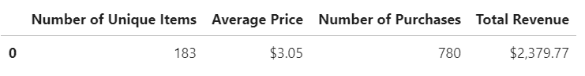
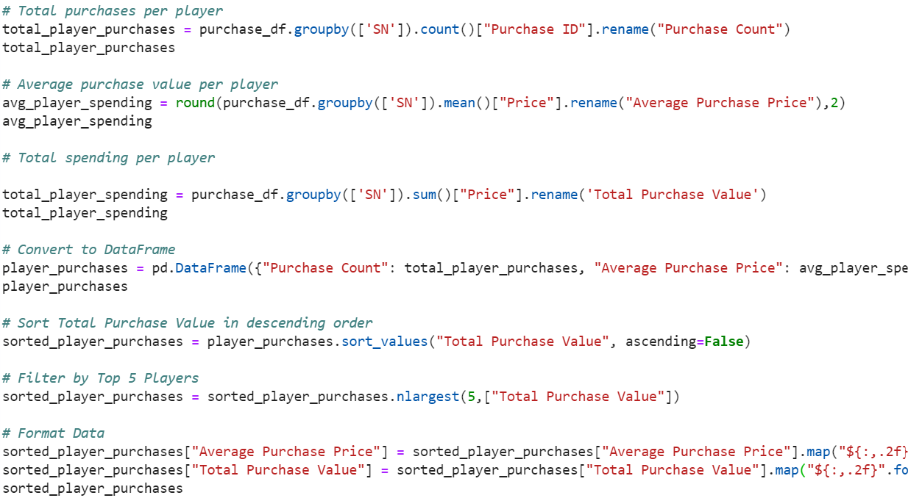
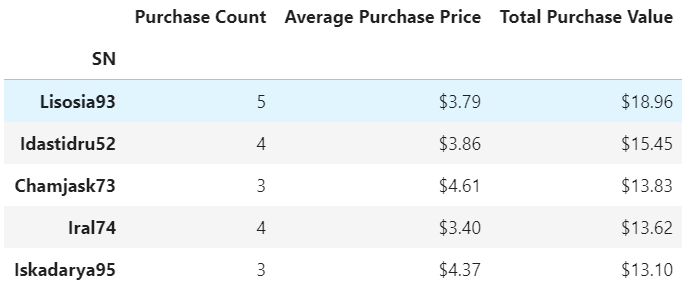
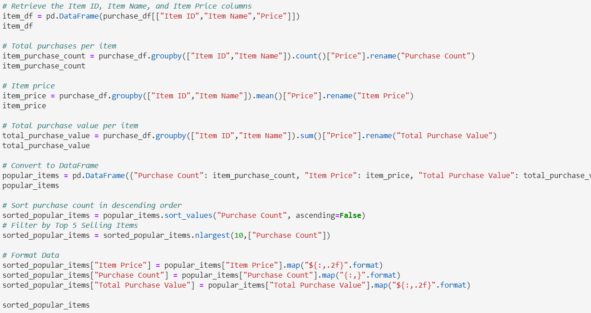

# Pandas Coding

Read and analyzed a .csv file via Pandas coding in Jupyter Lab, observing the data for a fantasy game, of an independent gaming company. 

Generated a report summarizing the game's purchasing data including the following:

## Purchasing Analysis

Calculated and structured a DataFrame providing: 1) Number of Unique Items, 2) Average Purchase Price, 3) Total Number of Purchases, 4) Total Revenue.

## Gender Demographics

Data grouped by Gender to provide: 1) Percentage and Count of Male Players, 2) Percentage and Count of Female Players, 3) Percentage and Count of Other / Non-Disclosed

## Purchasing Analysis by Gender

Gender data further analyzed to summarize consumer average and total purchases.  Pandas .groupby function utilized to calculate purchases per gender and structured into a DataFrame.  Data formatting used to clearly display totals by dollar or count.

## Age Demographics

The below each broken into bins of 4 years (i.e. <10, 10-14, 15-19, etc.)

1.  Purchase Count
2.  Average Purchase Price
3.  Total Purchase Value
4.  Average Purchase Total per Person by Age Group

## Top Spenders

Identify the the top 5 spenders in the game by total purchase value, then list (in a table):

SN
Purchase Count
Average Purchase Price
Total Purchase Value

## Most Popular Items

Identify the 5 most popular items by purchase count, then list (in a table):

Item ID
Item Name
Purchase Count
Item Price
Total Purchase Value

## Most Profitable Items

Identify the 5 most profitable items by total purchase value, then list (in a table):

Item ID
Item Name
Purchase Count
Item Price
Total Purchase Value

